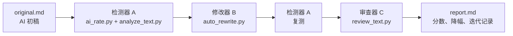

# 课程作业报告：Auto De-AI Writing Skill

[](https://github.com/Akimiya-z/auto-de-ai-writing-skill/actions/workflows/test.yml)

项目地址：[https://github.com/Akimiya-z/auto-de-ai-writing-skill](https://github.com/Akimiya-z/auto-de-ai-writing-skill)

示例报告：[examples/report.md](examples/report.md)

一键复现：

```bash
python scripts/run_pipeline.py
```

这是一个课程作业项目。它要解决的问题是：给定一段中文 AI 初稿，自动检测其中的 AI 写作痕迹，自动改写高风险部分，再复测并生成修改前后的对比报告。

## 摘要

本项目实现了一个 A/B/C 闭环：检测器 \(A\) 负责计算 `AI-like Rate` 并定位高风险句子，修改器 \(B\) 根据来源材料和作者补充信息生成修改稿，审查器 \(C\) 检查修改稿的证据覆盖、文本质量、事实边界和指标投机风险。

示例实验中，原文 `AI-like Rate` 为 `59.45%`，修改后为 `9.75%`，降幅为 `83.60%`；独立审查分为 `86.88 / 100`，超过默认阈值 `70`。README 本身按报告方式组织，包含作业题目、方法设计、公式、实验结果、复现命令、项目文件和后续改进方向。

## 结果总览

| 指标 | 修改前 | 修改后 | 变化 |
|---|---:|---:|---:|
| `AI-like Rate` | 59.45% | 9.75% | -49.70 |
| 模板表达 | 5 | 0 | -5 |
| 空泛词 | 19 | 2 | -17 |
| 连接词 | 9 | 1 | -8 |
| 具体细节 | 21 | 42 | +21 |
| 作者痕迹 | 0 | 4 | +4 |

| 审查项 | 得分 |
|---|---:|
| 证据覆盖 | 62.50 |
| 文本质量 | 100.00 |
| 完整性 | 100.00 |
| 反指标投机 | 100.00 |
| 总审查分 | 86.88 |

## 课程作业说明

本作业的题目可以概括为：如何通过自己构建的 GitHub 项目、skill 或其他 AI 工具，把 AI 生成文字自动改写成 AI-like 率更低的文本，并且要充分展示修改前后的效果。

本项目把作业题目落到一套可复现的自动化流程上：

1. 先用检测器 \(A\) 找出原文的 AI 写作痕迹，并计算项目内的 `AI-like Rate`。
2. 再用修改器 \(B\) 根据来源材料、作者补充信息和高风险句子生成修改稿。
3. 然后把修改稿交回检测器 \(A\) 复测，计算降幅。
4. 最后用独立审查器 \(C\) 检查修改稿是否只是为了刷分，是否保留事实边界和局限说明。

作业最终用下面这些材料展示效果：

- 原文分数、修改后分数和降幅公式。
- 原文命中的 AI 写作模式和高风险句子。
- 修改后模板表达、空泛词、连接词、作者痕迹等指标变化。
- 每轮检测、改写、复测、审查的迭代记录。
- 独立审查器给出的证据覆盖、文本质量、完整性和反指标投机分数。

本项目中的 `AI-like Rate` 是课程实验指标，用来展示同一套规则下的前后变化。学校或商业平台的检测结论属于另一套指标体系；本项目只报告自己的实验结果。

项目把“降 AI 率”拆成三个模块，让流程、改写和验收分开呈现：

- A：检测器，给文本计算一个可复现的 `AI-like Rate`。
- B：改写器，根据检测结果、来源材料和作者补充信息生成修改稿。
- C：审查器，独立检查修改稿是否吸收来源材料、是否保留局限说明、是否出现事实漂移或指标投机。

完整流程是：



循环的成功条件是：修改稿低于目标阈值，并且通过独立审查。未达标时继续迭代，直到改写收益过小或达到最大轮数。

## 作业目标

| 作业要求 | 本项目实现 |
|---|---|
| 自动测 AI 率 | `scripts/ai_rate.py` 计算统一的 `AI-like Rate` |
| 找出 AI 味来自哪里 | `scripts/analyze_text.py` 输出命中模式和高风险句子 |
| 自动降低 AI-like Rate | `scripts/adversarial_loop.py` 执行检测-改写-复测-审查闭环 |
| 防止刷本地分 | `scripts/review_text.py` 独立审查证据覆盖、质量、完整性和指标投机 |
| 展示前后效果 | `examples/report.md` 生成分数、降幅、特征变化和迭代记录 |
| 能复现 | 默认只依赖 Python 标准库，运行 `python scripts/run_pipeline.py` 即可 |

## 实验材料

| 文件 | 用途 |
|---|---|
| [examples/source_brief.md](examples/source_brief.md) | 说明作业场景和项目需求 |
| [examples/original.md](examples/original.md) | 保留典型 AI 口吻的中文初稿 |
| [examples/author_notes.md](examples/author_notes.md) | 作者补充材料、实现说明和限制 |
| [examples/voice_sample.md](examples/voice_sample.md) | 作者语气样本 |
| [examples/revised.md](examples/revised.md) | 自动闭环生成的修改稿 |
| [examples/report.md](examples/report.md) | 前后对比报告 |

## Quick Start

```bash
git clone https://github.com/Akimiya-z/auto-de-ai-writing-skill.git
cd auto-de-ai-writing-skill
python scripts/run_pipeline.py
```

运行后会更新三个示例文件：

- `examples/rewrite_prompt.md`
- `examples/revised.md`
- `examples/report.md`

当前示例输出：

```text
original: 59.45%
revised: 9.75%
stop: target and review reached
```

也就是示例文本从 `59.45%` 降到 `9.75%`，达到默认阈值 `25%`，同时通过独立审查。

## 方法设计

本项目把所谓“AI 率”定义成项目内的可复现实验指标，用来比较同一套流程下的修改前后变化。

本地检测器主要看六类信号：

| 组件 | 含义 |
|---|---|
| `template_score` | 模板化开头、结尾、套话 |
| `vague_score` | 空泛抽象词密度 |
| `connector_score` | 机械连接词和重复连接词 |
| `uniformity_score` | 句长是否过于平均 |
| `detail_gap_score` | 是否缺少具体材料 |
| `author_gap_score` | 是否缺少作者判断和写作痕迹 |

简化公式是：

$$
AI\text{-}like\ Rate=f(T,V,C,U,D,A)
$$

其中 \(T,V,C,U,D,A\) 分别对应模板表达、空泛词、连接词、句长均匀度、细节缺失和作者痕迹缺失。

前后降幅按下面公式计算：

$$
\text{reduction}=\frac{\text{before}-\text{after}}{\text{before}}\times100\%
$$

示例结果：

$$
\frac{59.45-9.75}{59.45}\times100\%=83.60\%
$$

循环停止条件包括：

$$
S_t \leq \tau
$$

或：

$$
\Delta_t=S_{t-1}-S_t<\epsilon
$$

或：

$$
t \geq T_{\max}
$$

其中 \(S_t\) 是第 \(t\) 轮修改后的 AI-like Rate，\(\tau\) 是目标阈值，\(\epsilon\) 是最小有效降幅，\(T_{\max}\) 是最大轮数。

独立审查器使用另一个分数：

$$
R_t=0.35G_t+0.25Q_t+0.20I_t+0.20M_t
$$

其中 \(G_t\) 是来源和作者材料覆盖度，\(Q_t\) 是文本质量，\(I_t\) 是事实和局限说明完整性，\(M_t\) 是反指标投机分。最终成功条件改成：

$$
S_t\leq\tau \land R_t\geq\rho \land B_t=0
$$

其中 \(B_t\) 是审查器发现的阻断项数量，例如“保证通过所有检测器”“绕过检测”“缺少检测分数局限说明”等。

## 分步运行

也可以按步骤执行：

```bash
python scripts/ai_rate.py examples/original.md
python scripts/analyze_text.py examples/original.md
```

独立审查修改稿：

```bash
python scripts/review_text.py \
  --original examples/original.md \
  --revised examples/revised.md \
  --notes examples/author_notes.md \
  --source examples/source_brief.md
```

生成改写提示：

```bash
python scripts/rewrite_prompt.py examples/original.md \
  --notes examples/author_notes.md \
  --source examples/source_brief.md \
  --voice examples/voice_sample.md \
  --out examples/rewrite_prompt.md
```

运行 A/B/C 闭环：

```bash
python scripts/adversarial_loop.py \
  --original examples/original.md \
  --notes examples/author_notes.md \
  --source examples/source_brief.md \
  --voice examples/voice_sample.md \
  --target-rate 25 \
  --max-rounds 5 \
  --provider local \
  --out examples/revised.md \
  --report examples/report.md
```

设置 `SAPLING_API_KEY` 后，`scripts/ai_rate.py` 可以优先调用 Sapling AI Detector API；未设置 key 时会自动使用本地规则评分。

## 示例文件

| 文件 | 作用 |
|---|---|
| `examples/source_brief.md` | 作业需求和示例来源 |
| `examples/original.md` | 待处理的中文 AI 初稿 |
| `examples/author_notes.md` | 作者补充材料和实现说明 |
| `examples/voice_sample.md` | 作者语气样本 |
| `examples/rewrite_prompt.md` | 根据检测结果生成的改写提示 |
| `examples/revised.md` | A/B/C 闭环自动生成的修改稿 |
| `examples/report.md` | 修改前后对比报告 |

报告中包含：

- 原始 AI-like Rate。
- 修改后 AI-like Rate。
- 降幅公式和计算过程。
- 命中的 AI 写作模式。
- 原文高风险句子。
- 本地特征变化。
- 独立审查分和阻断项。
- A/B/C 迭代记录。
- 局限说明。

## 核心脚本

| 脚本 | 作用 |
|---|---|
| `scripts/ai_rate.py` | 统一检测入口，输出 `AI-like Rate` |
| `scripts/analyze_text.py` | 分析模板表达、空泛词、连接词、高风险句子 |
| `scripts/rewrite_prompt.py` | 生成结构化改写提示 |
| `scripts/auto_rewrite.py` | 本地规则改写器 B |
| `scripts/review_text.py` | 独立审查器 C，检查证据覆盖、质量、完整性和指标投机 |
| `scripts/adversarial_loop.py` | 串联 A/B/C 循环 |
| `scripts/make_report.py` | 生成 Markdown 对比报告 |
| `scripts/voice_profile.py` | 从作者样本提取轻量风格信息 |
| `scripts/run_pipeline.py` | 一键运行示例流程 |

## 测试

```bash
python -m py_compile scripts/*.py
python -m unittest discover -s tests -v
```

仓库包含 GitHub Actions，push 和 pull request 时会自动运行同样的检查。

## 提交检查清单

交作业时可以直接给出项目地址，并提醒查看 README 和示例报告：

- 项目地址：[https://github.com/Akimiya-z/auto-de-ai-writing-skill](https://github.com/Akimiya-z/auto-de-ai-writing-skill)
- 核心报告：本 README。
- 详细运行结果：[examples/report.md](examples/report.md)。
- 原始 AI 初稿：[examples/original.md](examples/original.md)。
- 自动修改稿：[examples/revised.md](examples/revised.md)。
- 一键复现命令：`python scripts/run_pipeline.py`。
- 验证命令：`python -m unittest discover -s tests -v`。

## 后续改进方向

这个版本已经能作为课程作业展示自动化闭环。继续提升时，优先做下面几件事：

1. 增加多篇样本测试，把当前单篇 demo 扩展成一个小型评测集，报告平均降幅和波动范围。
2. 接入真实第三方检测 API，并把 API 返回结果缓存到 `examples/`，便于离线复核。
3. 给 `review_text.py` 增加人工评分字段，例如事实保真度、可读性和作者痕迹，让审查器更贴近课堂评分。
4. 把 `auto_rewrite.py` 扩展成 provider 接口，支持本地规则、OpenAI、Claude 或其他模型生成候选稿。
5. 增加消融实验，例如关闭作者材料、关闭审查器、关闭 voice sample，比较每个模块对最终结果的贡献。

## 作为 Skill 使用

这个仓库也是一个 Codex/Claude 风格的 skill：

- 核心说明：`SKILL.md`
- UI 元数据：`agents/openai.yaml`
- 工作流细节：`references/workflow.md`
- AI 写作模式表：`references/ai_tells_zh.md`

触发场景是：用户给出 AI 初稿，希望分析 AI 味、生成改写提示、保留作者材料，并输出修改前后的可解释报告。

## 项目结构

```text
auto-de-ai-writing-skill/
├── README.md
├── SKILL.md
├── LICENSE
├── .github/workflows/test.yml
├── agents/openai.yaml
├── examples/
│   ├── source_brief.md
│   ├── original.md
│   ├── author_notes.md
│   ├── voice_sample.md
│   ├── rewrite_prompt.md
│   ├── revised.md
│   └── report.md
├── references/
│   ├── ai_tells_zh.md
│   ├── inspiration.md
│   └── workflow.md
├── scripts/
│   ├── ai_rate.py
│   ├── analyze_text.py
│   ├── adversarial_loop.py
│   ├── auto_rewrite.py
│   ├── make_report.py
│   ├── review_text.py
│   ├── rewrite_prompt.py
│   ├── run_pipeline.py
│   └── voice_profile.py
└── tests/test_pipeline.py
```

## 限制

本项目的 `AI-like Rate` 是项目内实验指标，用于展示同一套规则下的修改效果。学校或商业平台的检测结果属于另一套指标体系，第三方检测器也只提供概率参考；作者身份需要结合来源材料、写作过程和人工判断。

本地 `auto_rewrite.py` 是为了让作业能离线复现的 baseline。正式提交文本时，建议结合 `examples/rewrite_prompt.md` 做人工检查和二次精修。

所有改写都以用户提供的材料为边界。来源、经历、引用和 API 结果需要可核验依据。

## License

MIT License. See `LICENSE`.
